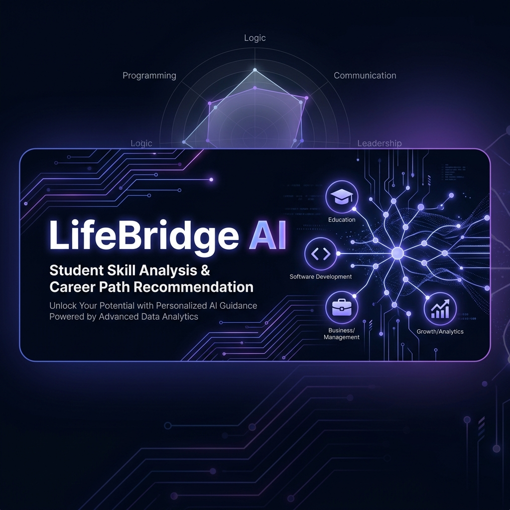
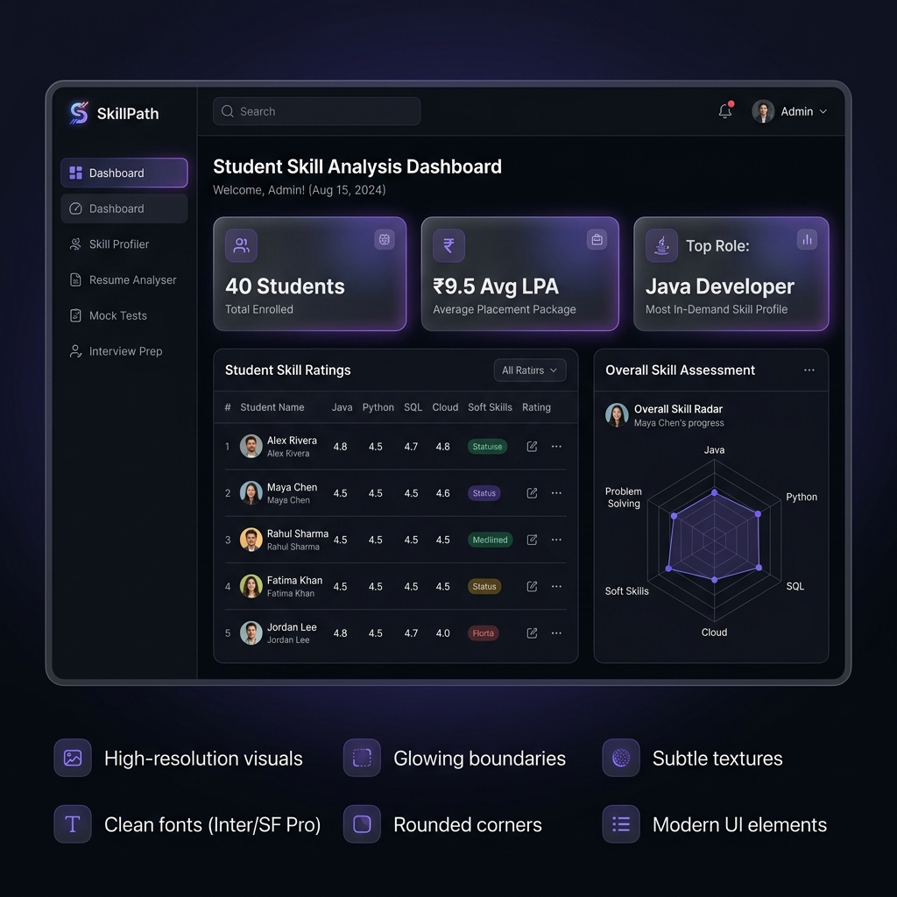

<p align="center">
  
</p>

<h1 align="center">🚀 LifeBridge AI</h1>
<h3 align="center">Student Skill Analysis & Career Path Recommendation System</h3>

<p align="center">
  
  
  
  
  
</p>

---

## 📌 About The Project

**LifeBridge AI** is an intelligent, AI-powered web application designed to bridge the gap between student skills and industry expectations. It analyzes student profiles, predicts career paths using Machine Learning, reviews resumes for ATS compliance, and prepares students for placement interviews — all in one seamless platform.

Built under the **"Agents for Good"** track, this project aims to democratize career guidance for students who lack access to expensive career counseling by providing data-driven, personalized recommendations powered by a **Random Forest ML model** trained on real-world student career datasets.

<p align="center">
  
</p>

---

## ✨ Key Features

### 🎯 1. Skill Profiler & LPA Predictor
- Interactive sliders for rating technical skills (Java, Python, Web Dev, DSA) and soft skills (Communication, Leadership)
- Input academic metrics: CGPA, Projects, Internships, Certifications
- **Random Forest ML model** predicts the best-fit career role and expected salary package (LPA)
- Visual circular gauge showing predicted LPA with detailed factor breakdown
- Save profiles directly to the SQLite database for model retraining

### 📄 2. Resume Analyser & ATS Optimizer
- Paste resume text and scan for:
  - **Spelling & grammar mistakes** with automatic corrections
  - **Missing resume sections** (Education, Skills, Projects, Experience, Contact)
  - **ATS keyword matching** against target role requirements
- Overall resume score (0-100%) combining section completeness, contact info, and keyword match
- Side-by-side view of original vs. corrected resume text

### 🗺️ 3. Career Roadmap & Skills Gap Analysis
- **Custom SVG Radar Chart** comparing student's current skills vs. industry benchmarks for the recommended role
- Step-by-step **learning path milestones** (e.g., for Full Stack: HTML → React → Node.js → MongoDB → Deployment)
- Interactive milestone tracker — check off completed steps
- Curated links to Coursera, Udemy, and other learning platforms

### 📝 4. Domain-Specific Mock Tests
- Timed 10-minute MCQ assessments for:
  - **Java Developer** (OOP, Spring Boot, DSA)
  - **Full Stack Developer** (HTML/CSS/JS, React, Node.js, MongoDB)
  - **Data Scientist** (Python, ML, Statistics, SQL)
- Real-time countdown timer with auto-submission
- Detailed answer review with explanations
- **Test scores dynamically update the predicted LPA** — scoring 90%+ boosts your package prediction!

### 💬 5. Interview Question Bank
- Role-specific technical and behavioral questions with:
  - **Model answer keys** with detailed explanations
  - **Pro preparation tips** for each question
  - **Company tags** showing which companies commonly ask each question (Amazon, Google, TCS, Zoho, etc.)
- Accordion-style expandable Q&A panels

### 📊 6. Training Dataset Dashboard
- Live view of the **40-student SQLite database** used to train the ML model
- Searchable and filterable data table
- Aggregate statistics: total profiles, average LPA, top role, highest package
- Visual explanation of the Random Forest decision pipeline

---

## 🏗️ Tech Stack

| Layer | Technology | Purpose |
|-------|-----------|---------|
| **Frontend** | React 19 + Vite | Reactive SPA with glassmorphic UI |
| **Styling** | Vanilla CSS | Custom dark-mode theme, gradients, animations |
| **Icons** | Lucide React | Modern outline icon library |
| **Backend** | Python Flask | REST API server with CORS |
| **ML Engine** | Scikit-Learn | Random Forest Classifier + Regressor |
| **Database** | SQLite | Lightweight relational student database |
| **Data Processing** | Pandas, NumPy | Feature engineering and data wrangling |

---

## 📂 Project Structure

```
LifeBridge-AI/
├── assets/                     # Banner and preview images
├── .github/
│   └── workflows/
│       └── ci.yml              # GitHub Actions CI workflow
├── backend/
│   ├── app.py                  # Flask API server (endpoints for predict, resume, tests, interview)
│   ├── database.py             # SQLite schema + seed data (40 student profiles)
│   └── ml_model.py             # Random Forest training & prediction pipeline
├── frontend/
│   ├── src/
│   │   ├── App.jsx             # Main layout with sidebar navigation
│   │   ├── index.css           # Premium dark-mode design system
│   │   ├── main.jsx            # React entry point
│   │   └── components/
│   │       ├── Dashboard.jsx       # Stats overview + dataset table
│   │       ├── SkillProfiler.jsx   # Input form + LPA gauge
│   │       ├── ResumeAnalyser.jsx  # Resume scanner + ATS checker
│   │       ├── Roadmap.jsx         # SVG radar chart + milestone tracker
│   │       ├── MockTests.jsx       # Timed MCQ engine
│   │       └── InterviewPrep.jsx   # Accordion Q&A bank
│   ├── package.json
│   └── vite.config.js
├── .gitignore
└── README.md
```

---

## 🚀 Getting Started

### Prerequisites
- **Node.js** v18+ and npm
- **Python** 3.10+
- **Git**

### Installation & Setup

#### 1. Clone the Repository
```bash
git clone https://github.com/ponnadabhanuprakash/LifeBridge-AI.git
cd LifeBridge-AI
```

#### 2. Setup Backend (Python Flask + ML)
```bash
# Create virtual environment
cd backend
python -m venv venv

# Activate virtual environment
# Windows:
venv\Scripts\activate
# macOS/Linux:
source venv/bin/activate

# Install dependencies
pip install flask flask-cors pandas scikit-learn numpy

# Initialize database and train ML models
python database.py
python ml_model.py

# Start the Flask server
python app.py
# Backend runs at http://localhost:5000
```

#### 3. Setup Frontend (React + Vite)
```bash
# Open a new terminal
cd frontend

# Install dependencies
npm install

# Start the development server
npm run dev
# Frontend runs at http://localhost:5173
```

#### 4. Open the Application
Navigate to **http://localhost:5173** in your browser. Both servers must be running simultaneously.

---

## 🧠 Machine Learning Model

### Algorithm: Random Forest (Scikit-Learn)

The system uses two trained models:

| Model | Type | Purpose |
|-------|------|---------|
| **Role Classifier** | `RandomForestClassifier` | Predicts the best-fit career role |
| **LPA Regressor** | `RandomForestRegressor` | Predicts expected salary package |

### Input Features (10 dimensions)
```
CGPA, Java, Python, Web Dev, DSA, Communication, Leadership, Projects, Internships, Certifications
```

### Output
```
→ Recommended Career Role (e.g., "Java Developer", "Data Scientist")
→ Predicted Package in LPA (e.g., ₹8.5 LPA)
→ Personalized Learning Path
→ Target Companies
→ Skill Gap Analysis
```

### Training Dataset
The model is trained on **40 student profiles** seeded in SQLite covering 8 career roles:
- Java Developer, Full Stack Developer, Data Scientist, Machine Learning Engineer
- Data Analyst, Cybersecurity Analyst, DevOps Engineer, Project Manager

The model **retrains dynamically** when new student profiles are saved through the UI!

---

## 📊 Career Path Mapping

| Skills Combination | Recommended Path | Avg Package (India) |
|---|---|---|
| Java + DSA (8+) | Java Developer | ₹5-10 LPA |
| HTML/CSS/JS + React + Node.js | Full Stack Developer | ₹6-12 LPA |
| Python + SQL + Power BI | Data Analyst | ₹5-9 LPA |
| Python + ML + Statistics | Data Scientist | ₹8-18 LPA |
| Python + TensorFlow + Deep Learning | ML Engineer | ₹10-20 LPA |
| Linux + Docker + AWS | DevOps Engineer | ₹8-15 LPA |
| Networking + Security Tools | Cybersecurity Analyst | ₹6-14 LPA |
| Communication + Leadership (9+) | Project Manager | ₹7-14 LPA |

---

## 📑 Dataset References

This project draws inspiration from the following open datasets:

- [Student Career Dataset — Mendeley Data](https://data.mendeley.com/datasets/4spj4mbpjr)
- [Skill & Career Recommendation Dataset — Kaggle](https://www.kaggle.com/datasets/tea340yashjoshi/skill-and-career-recommendation-dataset)
- [Student Career & Entrepreneurship Dataset — Kaggle](https://www.kaggle.com/datasets/programmer3/student-career-and-entrepreneurship-dataset)
- [Vocational Skill-Job Matching Dataset — Kaggle](https://www.kaggle.com/datasets/ziya07/vocational-skill-job-matching-dataset)

**Research Reference:**
- [C3-IoC: Career Guidance System using ML — PMC](https://pmc.ncbi.nlm.nih.gov/articles/PMC9715283/)

---

## 🤝 Contributing

Contributions are welcome! To contribute:

1. Fork the repository
2. Create a feature branch (`git checkout -b feature/amazing-feature`)
3. Commit your changes (`git commit -m 'Add amazing feature'`)
4. Push to the branch (`git push origin feature/amazing-feature`)
5. Open a Pull Request

---

## 📝 License

This project is open source and available under the [MIT License](LICENSE).

---

<p align="center">
  Built with ❤️ for <strong>Agents for Good</strong> Track
</p>
